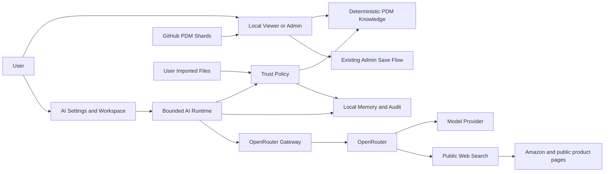

# JinTai PDM AI Assistant Master Implementation Plan

> **For agentic workers:** REQUIRED SUB-SKILL: Use `subagent-driven-development` or `executing-plans` to implement this plan one release at a time. Use test-driven development for every behavior change. No release may self-approve, publish, mutate GitHub data, or skip its gate.

**Goal:** Add a maintainable, evidence-grounded PDM/BOM AI assistant to the portable JinTai Viewer/Admin while preserving the standalone `viewer.html` delivery model, PDM revision rules, exact 24-shard runtime, and explicit human control over every write.

**Architecture:** Build one isolated AI feature with a small facade over six deep boundaries: deterministic PDM knowledge, OpenRouter transport, trust policy, bounded runtime, local persistence, and workspace UI. Start with direct browser BYOK as an explicitly high-risk pilot because the user requires one shareable HTML. Preserve the transport seam for a later company gateway without building a speculative multi-provider framework.

**Tech stack:** Existing browser ES modules, vanilla JavaScript, esbuild, Node.js built-in test runner, IndexedDB/localStorage where available, OpenRouter HTTPS APIs, Playwright for browser acceptance after the UI phase.

**Plan status:** Proposed only. This file does not authorize implementation, branch creation, dependency installation, publication, GitHub writes, or canonical data changes.

**Baseline verified:** `main` / `origin/main` at `4647fe4758008c5744bb7d24d59eec4c10424514` on 2026-07-16.

---

## 1. Executive Decision

The professional target is not “a general autonomous AI like Codex inside one HTML file.” The target is a bounded PDM specialist that is better than a generic chatbot at JinTai product, BOM, material, revision, where-used, SKU, and quality workflows because its facts and actions are controlled by deterministic tools, versioned rules, citations, evaluations, and approval gates.

The selected delivery sequence is:

```text
Release 0  Restore source/build truth and secure the credential host
Release 1  Deterministic PDM knowledge, tools, skills, citations, and evals
Release 2  OpenRouter BYOK, Settings, and read-only AI workspace
Release 3  Controlled memory, knowledge import, marketplace, and review insights
Release 4  Admin structured proposals and exact dry-run diffs
Release 5  Limited local apply after approval; existing Save to GitHub remains separate
Optional    Company AI gateway for central auth, budgets, audit, and shared memory
```

Every release is independently useful, testable, reversible, and blocked by a go/no-go gate.

---

## 2. Verified Findings Before AI Work

### F-001 — The current baseline is not fully green

- `npm run test` passes 213 tests.
- `npm run check:generated` fails with `app-admin.js is stale; run npm run build`.
- Commit `4647fe4` changed only generated `app-admin.js`, while `AI_DEBUG_GUIDE.md` and `docs/ARCHITECTURE.md` explicitly forbid hand-editing generated artifacts.
- The generated change includes source-missing behavior such as the View Changes diff modal and submit-label changes.

**Decision:** Release 0 must reconstruct that behavior in canonical source, add regression tests, rebuild all four artifacts, and restore `npm run check` before any AI code is accepted.

### F-002 — The current page is not a safe API-key host

`src/shell.html` executes third-party JavaScript from:

- unpinned `https://unpkg.com/@google/model-viewer/dist/model-viewer.min.js`
- `https://cdn.sheetjs.com/xlsx-0.20.3/package/dist/xlsx.full.min.js` without integrity pinning

Any JavaScript executing in the same page can read a password input, inspect DOM state, or intercept requests. This is incompatible with claiming that an OpenRouter key is safely handled in-browser.

**Decision:** No AI credential UI may ship until remote executable scripts are replaced by reviewed, version-pinned, locally bundled or vendored bytes and a restrictive CSP is generated.

### F-003 — `src/application.js` is already an orchestration hotspot

- Approximately 2,574 lines.
- Owns application state, event binding, i18n dictionaries, cloud loading, Admin saves, and UI orchestration.

**Decision:** AI business logic must not be added to this file. The integration budget is one factory call plus lifecycle/context callbacks, targeted at fewer than 80 added lines.

### F-004 — Settings is static UI, not a feature

`src/shell.html` currently renders a non-interactive `<div class="sidebar-footer">` with hardcoded `Settings`.

**Decision:** Convert it to an accessible Settings button and add a separate AI Assistant button. Settings configures AI; the AI Assistant opens a context-aware right drawer so the BOM remains visible while the user asks questions.

### F-005 — The local HTML deployment has no real identity or central governance

The current Viewer/Admin distinction is a build mode, not authenticated RBAC. Local browser storage is not a team memory service or tamper-evident audit system.

**Decision:** Direct BYOK supports a local pilot and per-browser memory only. Do not describe it as enterprise RBAC, shared memory, or compliance-grade audit. A company gateway becomes mandatory if the project later needs a shared company key, centralized policies, durable audit, user identity, or team memory.

### F-006 — Amazon review access is constrained

- The supplied Amazon page confirms SONGMICS model `ULGS433BH02S` and ASIN `B0GTZDGNGN`.
- Canonical PDM data contains internal SKU `LGS433BH02S` under product `LGS433`, black.
- Amazon's Customer Feedback API is for Sellers and Vendors with required roles. JinTai is the manufacturer and has no Seller/Vendor access.

**Decision:** Use curated aliases, public web search through OpenRouter, and explicit local CSV/JSON/text imports. Do not implement live Amazon scraping from `file://`, do not depend on Seller Partner API, and never treat a public review as verified root cause.

---

## 3. Self-Critique and Rejected Approaches

| Rejected approach | Why it is rejected |
|---|---|
| Put prompts, fetch calls, memory, and UI directly into `application.js` | It deepens the existing hotspot and makes provider failures difficult to isolate or test. |
| Build dozens of tiny provider/tool/skill classes | One provider and one local dataset do not justify a framework. It creates pass-through files and debugging indirection. |
| Add a generic OpenAI-compatible endpoint field in Release 2 | Arbitrary endpoints increase data-leak and support risk. OpenRouter is the only supported provider until a second real provider is approved. |
| Store the OpenRouter key in localStorage, sessionStorage, IndexedDB, HTML, or config | A shareable file and browser storage are not secret stores. The key remains in memory only. |
| Fine-tune a model first | The data changes frequently, provenance is required, and fine-tuning does not solve permissions, citations, or prompt injection. |
| Add embeddings/vector DB first | The current baseline is only 22 products, 628 materials, and 2,725 BOM entries. Deterministic indexes are simpler, faster, explainable, and sufficient until measured recall proves otherwise. |
| Let the model read the complete PDM payload every turn | It increases cost and proprietary-data exposure. Only the minimum records returned by validated tools may cross the model boundary. |
| Download skills or instructions from arbitrary repositories and trust them | Imported content is untrusted data and may contain prompt injection. Only reviewed, versioned packs may become instructions. |
| Scrape Amazon pages/reviews directly in the HTML | CORS, CAPTCHA, markup churn, source terms, and review visibility make it brittle and hard to audit. |
| Let AI write directly to GitHub | It violates least privilege and the existing save/revision model. AI never receives the GitHub token or writer. |
| Claim shared/team memory in a local file | There is no authenticated identity or shared durable store. Release 3 memory is local-browser memory only. |
| Build the company gateway before validating user value | It delays the required one-file pilot. The client seam is preserved, but the service is a separate decision after pilot evidence. |

---

## 4. Architecture Options and Selected Path

| Option | Strengths | Weaknesses | Decision |
|---|---|---|---|
| A. Standalone HTML + each user's OpenRouter key | Meets the one-file requirement, fastest pilot, no shared company secret | Key exists in browser memory, no central RBAC, no shared memory, local-only audit, provider CORS dependency | **Selected for Releases 1–5 pilot**, with explicit warnings and strict controls |
| B. Standalone HTML + lightweight company AI gateway | Keeps one-file client, central key isolation, budgets, model routing, audit, auth, kill switch | Requires hosting, auth design, operations, and a backend owner | **Recommended before organization-wide shared-key rollout** |
| C. Full PDM AI platform with server retrieval/vector DB/tool executor | Strongest governance and scale | Highest cost and complexity; duplicates current local-first architecture | **Rejected now; reconsider only after measured scale or governance need** |

### Architecture decision

Implement Option A behind interfaces that allow Option B to replace only the transport and persistence boundaries. Do not create a generic provider base class. Add a second adapter only when a second provider or gateway actually exists.

### System and trust-boundary diagram



The AI feature has no edge to `X`. It cannot receive the GitHub token, `githubData.write`, asset writer, or release/effectivity mutation.

---

## 5. Deep Module Boundaries

### Public facade

Create one integration seam:

```js
createAiAssistantFeature({
  mode,
  getSnapshot,
  onNavigate,
  fetchImpl,
  storage,
  clock,
});
```

The returned object exposes only:

```js
{
  mount(),
  updateSnapshot(),
  openSettings(),
  openWorkspace(),
  destroy(),
}
```

`getSnapshot()` returns:

```js
{
  payload,
  sourceMetadata,
  selection: { productCode, color, revision, materialId },
  lang,
  dirty,
}
```

It must never return the GitHub token, OpenRouter key, GitHub writer, asset writer, or DOM nodes.

### Planned source layout

```text
src/features/ai-assistant/
  index.js                 Public facade and dependency wiring
  contracts.js             Versioned schemas, validators, stable error codes
  pdm-knowledge.js         Indexes, retrieval, read-only tools, citations
  openrouter-gateway.js    The only OpenRouter endpoint and Authorization owner
  trust-policy.js          Scope, tool, context, output, memory, and budget policy
  runtime.js               Bounded model/tool loop and cancellation
  local-store.js           Settings metadata, memory, audit, migrations
  workspace-view.js        Settings dialog and AI drawer DOM behavior
  i18n.js                  zh-CN and Vietnamese dictionaries by key
  knowledge-import.js      Release 3 untrusted file/repository-reference import
  marketplace-insights.js Release 3 SKU aliases and Voice of Customer analysis
  proposal-engine.js       Release 4/5 validated Admin proposals and local apply
```

Do not split a file merely to make it shorter. Split only when a boundary has independent policy, state, or external I/O.

### Dependency rules

- `application.js` may import only `index.js`.
- AI modules must not import `application.js`.
- `pdm-knowledge.js`, `trust-policy.js`, and `proposal-engine.js` stay DOM-free.
- `workspace-view.js` is the only AI module that manipulates DOM.
- `openrouter-gateway.js` is the only AI module containing `https://openrouter.ai` or an OpenRouter `Authorization` header.
- `local-store.js` is the only AI module using IndexedDB/localStorage.
- No AI module imports `github-git-data.js`, `github-asset-storage.js`, or calls `githubData.write`.

---

## 6. User Flows

### Viewer flow

1. Open the shared `viewer.html`.
2. Core PDM loads normally even if AI initialization fails.
3. Click **Settings**.
4. Select Provider `OpenRouter`, enter API key, select a compatible model and optional fallbacks.
5. Review the proprietary-data notice and strict privacy defaults.
6. Click **Test connection**. The app calls `/api/v1/key` and model metadata endpoints without sending PDM content.
7. The password field clears after the gateway captures the key in memory.
8. Click **AI Assistant**.
9. The drawer shows the current product/color/revision context and the data-sharing scope.
10. Ask a question or choose a quick skill.
11. The runtime retrieves only necessary records, validates every tool call, sends minimal context, and renders text plus verified citation chips.
12. Viewer receives no mutation controls.

### Admin flow through Release 3

Admin receives the same read-only assistant plus warnings about Draft/Released/effective revision rules, data quality, and where-used impact. It still cannot create or apply changes.

### Admin flow in Release 4

1. User asks for a change.
2. AI returns a structured proposal only.
3. Proposal engine validates current Admin mode, current Draft revision, clean baseline, source version, fields, and allowed operation.
4. App applies the proposal to a cloned payload.
5. Existing `describePayloadChanges` produces an exact preview.
6. User may reject or approve the proposal for local application.
7. No canonical state changes in Release 4.

### Admin flow in Release 5

1. User approves one validated operation.
2. Proposal applies atomically to local app state and calls `markDirty()`.
3. The user independently reviews the normal PDM diff.
4. The existing explicit **Save to GitHub** flow remains the only cloud write.
5. Release, effectivity, deletes, assets, and GitHub save remain unavailable to AI.

---

## 7. Trust Hierarchy, Knowledge, Skills, and Tools

### Trust hierarchy

Higher levels may constrain lower levels; lower levels may never override higher levels.

| Rank | Source | Trust treatment |
|---|---|---|
| 1 | Hard-coded security and PDM policy in source | Highest authority |
| 2 | Reviewed, versioned company prompt/skill/rule packs | Trusted instructions |
| 3 | Canonical commit-pinned PDM shards | Authoritative product/BOM facts |
| 4 | User-confirmed local memory | Trusted only within its recorded scope/version |
| 5 | Current user prompt | Request, not policy |
| 6 | Imported files, repositories, web pages, Amazon content, reviews | Untrusted evidence only |
| 7 | Model inference | Hypothesis unless grounded by levels 2–6 |

### Versioned packs

```text
knowledge/
  README.md
  ai/
    prompt-pack.json
    skills.json
  pdm-expert-pack.json
  marketplace-aliases.json
```

Every pack contains `schemaVersion`, `packVersion`, `updatedAt`, and provenance. The build validates and bundles only reviewed packs. Runtime imports never become instruction packs automatically.

### Initial skill registry

| Skill ID | Purpose | Allowed tools |
|---|---|---|
| `pdm-search` | Find products/materials by code, name, spec, component, or SKU | `search_products`, `get_product`, `get_material` |
| `bom-analysis` | Explain a product BOM and multi-level structure | `get_product`, `get_bom`, `get_material` |
| `bom-comparison` | Compare products, colors, or revisions | `get_bom`, `compare_boms` |
| `where-used-impact` | Identify products/parents affected by a material | `get_material`, `where_used` |
| `revision-effectivity` | Explain current, effective, historical, Draft, and Released state | `get_product`, `get_revision_history` |
| `data-quality-audit` | Detect deterministic data anomalies and explain impact | `audit_product_data`, `get_product`, `get_material` |
| `sku-marketplace-resolution` | Resolve internal, marketplace, ASIN, and color aliases | `resolve_sku`, `get_product` |
| `marketplace-product-context` | Compare public product facts with PDM facts | Release 3 marketplace evidence tools |
| `voice-of-customer` | Summarize review themes and propose investigation candidates | Release 3 review tools |
| `admin-change-proposal` | Produce a schema-valid dry-run proposal | Release 4 proposal tools only |

Each skill specifies version, supported modes, allowed tools, maximum calls, required evidence, output schema, and refusal rules.

### Read-only tool contract

Every tool returns:

```js
{
  ok: true,
  data: {},
  evidence: [{
    id: "PDM-1",
    sourceType: "pdm",
    sourcePath: "data/products/LGS433.json",
    recordId: "LGS433",
    sourceCommit: "40-char-sha",
    capturedAt: "ISO-8601",
  }],
  truncated: false,
  warnings: [],
}
```

Initial tools:

- `search_products`
- `get_product`
- `resolve_sku`
- `get_bom`
- `compare_boms`
- `get_material`
- `where_used`
- `get_revision_history`
- `audit_product_data`

No generic URL fetch, shell, file write, code execution, database query, or GitHub write tool exists.

### Deterministic SKU resolution

Resolution order:

1. Exact product code.
2. Exact internal color SKU found in `color_info.sku`.
3. Marketplace prefix normalization only when the normalized value exactly matches an internal SKU.
4. Curated alias record for ASIN, URL, or non-reversible naming.
5. Fuzzy results are suggestions and never auto-resolve.

Required golden case:

```text
Marketplace model: ULGS433BH02S
Internal SKU:      LGS433BH02S
Product:           LGS433
Color:             black / 黑色
ASIN:              B0GTZDGNGN
Internal size:     300D x 1138W x 681H mm
Amazon size:       11.8D x 44.8W x 26.8H in
```

Dimension comparison may normalize inches to millimeters with a documented tolerance, but the identity is not inferred from dimensions alone.

---

## 8. OpenRouter Design

### Provider scope

- Release 2 supports only `OpenRouter`.
- Settings shows a Provider field because the user requested it, but exposes no unsupported provider.
- Do not add a base provider class until a second adapter is approved.

### Credential handling

- Accept key through `<input type="password" autocomplete="off">`.
- Store it only in a private gateway closure.
- Clear the input after connection.
- Never write it to localStorage, sessionStorage, IndexedDB, logs, errors, memory, diagnostics, HTML, or generated artifacts.
- Provide explicit **Clear key** and clear it on page unload.
- Redact any matching substring from provider errors before surfacing them.

### Model registry and capability grading

Use current metadata from:

- `GET /api/v1/models?supported_parameters=tools`
- `GET /api/v1/model/{author}/{slug}`

Cache non-secret model metadata for no more than six hours and refresh on Settings open.

| Grade | Required capabilities | Allowed behavior |
|---|---|---|
| A | `tools`, `tool_choice`, `structured_outputs` or strict `response_format` | Full grounded read-only assistant and, later, proposals |
| B | `tools` and `tool_choice` | Read-only assistant with reduced response guarantees |
| Unsupported | No reliable tool calling | No PDM agent mode |

Do not hardcode a “free models” list. Derive pricing/capability from current model metadata. Paid fallback is disabled by default.

### Connection and health checks

- `GET /api/v1/key` validates the key and may display safe fields such as remaining limit and expiry.
- Model metadata validation does not spend inference credits.
- A real model test is a separate explicit low-token action with a cost warning.
- Do not retry `400`, `401`, or `403`.
- Retry one idempotent inference request for timeout/`408`/`429`/`5xx`, then use the user-approved fallback chain.
- Local circuit breaker opens after three transient failures within two minutes and remains open for 60 seconds.

### Routing and privacy defaults

Default request policy:

```js
{
  provider: {
    require_parameters: true,
    data_collection: "deny",
    zdr: true,
    allow_fallbacks: true,
  },
  parallel_tool_calls: false,
}
```

Strict privacy may reduce available models/providers. The app must fail closed and explain the route failure; it must never silently relax ZDR or data-collection rules.

### Web search

- Use the `openrouter:web_search` server tool.
- Do not use deprecated `plugins: [{ id: "web" }]` or `:online` model variants.
- Hide behind a feature flag because the server tool is beta.
- For Amazon product research, use `allowed_domains: ["amazon.com"]`, bounded results, and bounded total characters.
- Default maximum is one web-search request and five total results per user turn.
- External snippets remain untrusted and retain URL citations.

### Bounded runtime defaults

- Maximum 3 model calls per turn.
- Maximum 6 local tool calls per turn.
- Maximum 1 web-search request per turn by default.
- Maximum 90 seconds total turn time.
- Maximum 45 seconds per provider request.
- Maximum 1,200 output tokens.
- Maximum five external evidence items.
- Context includes only selected/matched records and stays below the lower of 32,000 tokens or 25% of model context.
- If an estimated non-free turn exceeds the configured soft limit, require confirmation.
- Always expose model actually used, fallback status, token usage, and returned cost metadata.

---

## 9. Memory and Learning Design

### Memory states

```text
session -> candidate -> confirmed
                    -> rejected
confirmed -> stale when dependent PDM source changes
```

- Session memory exists in RAM.
- The model may propose candidate memory.
- Only the user can confirm it.
- Rejected memory is retained only to avoid repeated proposals, unless deleted.
- Stale memory is not injected into prompts until reconfirmed.
- Model output never promotes itself.

### Memory record

```js
{
  schemaVersion: 1,
  id: "memory_...",
  status: "candidate|confirmed|rejected|stale",
  scope: {
    project: "jintai-pdm",
    productCode: "LGS433",
    sku: "LGS433BH02S",
    materialId: "",
  },
  fact: "Market model ULGS433BH02S maps to internal SKU LGS433BH02S.",
  provenance: [{
    sourceType: "user-confirmed|pdm|marketplace",
    sourceRef: "B0GTZDGNGN",
    capturedAt: "ISO-8601",
  }],
  sourceCommit: "40-char-sha",
  promptPackVersion: "x.y.z",
  createdAt: "ISO-8601",
  confirmedAt: "ISO-8601",
}
```

### Storage limitations

- Use IndexedDB with schema migrations when available.
- Persist provider/model/privacy preferences, but never the API key.
- `file://` storage behavior is browser/path dependent. Detect storage capability at startup.
- If unavailable, switch to session-only mode with a visible warning.
- Always support memory/audit export, import, and delete.
- Do not call this user/team memory because there is no identity boundary.

---

## 10. Marketplace and Voice of Customer

### Marketplace alias model

Curated aliases live outside canonical PDM shards:

```js
{
  schemaVersion: 1,
  marketplace: "amazon.com",
  marketplaceModel: "ULGS433BH02S",
  internalSku: "LGS433BH02S",
  productCode: "LGS433",
  color: "black",
  asin: "B0GTZDGNGN",
  sourceUrl: "https://www.amazon.com/dp/B0GTZDGNGN",
  status: "confirmed",
  confirmedBy: "user",
}
```

### Review ingestion paths

1. OpenRouter web search for public, cited evidence.
2. Explicit CSV/JSON/text import supplied by the user.
3. Local reviewed snapshots.

No direct page scraper, browser automation, CAPTCHA bypass, or Seller Partner integration is in scope.

### Review issue taxonomy

- assembly and instructions
- missing or damaged parts
- packaging and shipping
- stability and safety
- drawer fit and operation
- electronics, LED, outlets, or charging
- dimensions and fit
- finish, color, and appearance
- odor and material
- durability and wear

### Evidence lifecycle

| State | Meaning |
|---|---|
| `observed` | One external signal exists |
| `repeated` | Multiple independent external signals share a normalized issue |
| `investigating` | A human opened an internal investigation |
| `verified` | Internal evidence confirms a cause or defect |
| `corrective_action` | An approved action/revision is linked |

AI may move nothing beyond `repeated`. Only a user may set `investigating`, `verified`, or `corrective_action`.

AI may correlate a review theme with BOM candidates, but must label the result as a hypothesis. It must not state that a BOM component is the root cause without internal verified evidence.

---

## 11. Repository-Grounded Threat Model

### Assets

| Asset | Security objective |
|---|---|
| OpenRouter API key | Confidentiality |
| GitHub Admin token | Confidentiality and privilege isolation |
| Proprietary product/BOM/material/revision data | Confidentiality and integrity |
| Canonical 24-shard dataset | Integrity and availability |
| Confirmed memory and company rule packs | Integrity and provenance |
| AI proposals and approval state | Integrity and non-repudiation within local limits |
| Generated Viewer/Admin artifacts | Integrity and supply-chain trust |
| Local audit metadata | Confidentiality and diagnostic integrity |

### Attacker assumptions

Capabilities:

- A user can enter malicious prompts.
- Imported files and public web pages can contain indirect prompt injection.
- A compromised model/provider may return malformed or malicious output.
- A malicious or compromised remote script can execute in the current page.
- A local user or browser extension can inspect browser memory and DOM.

Non-capabilities:

- A remote anonymous attacker does not have a JinTai server endpoint because the app is a local static file.
- Release 1–3 AI has no GitHub writer capability.
- Local audit/memory is not treated as tamper-proof.

### Threat table

| ID | Threat | Priority | Required controls |
|---|---|---|---|
| TM-001 | Remote executable script or XSS steals the OpenRouter/GitHub credential | Critical | Remove remote executable scripts before key UI; CSP; text-only model rendering; dependency hashes/licenses |
| TM-002 | Imported/web content performs indirect prompt injection | High | Trust hierarchy; external-content delimiters; no instruction promotion; tool allowlist; adversarial tests |
| TM-003 | Excess PDM data is sent to a provider | High | Minimal retrieval scope; data preview; explicit consent; ZDR/data-collection deny; no full-payload prompt |
| TM-004 | Model calls an unknown or over-privileged tool | High | Exact allowlist; schema validation; mode checks; no generic tools; call/turn limits |
| TM-005 | Model output injects HTML, links, images, or script | High | Render with `textContent`; controlled citation elements; no raw Markdown HTML or external images |
| TM-006 | Model or imported content poisons persistent memory | High | Candidate/confirmed states; provenance; human confirmation; stale-on-source-change |
| TM-007 | AI proposal bypasses PDM Draft/Released/effectivity rules | High | Deterministic proposal validator; current Draft only; clean/source-version checks; release/effectivity excluded |
| TM-008 | AI or UI leaks the GitHub token to the OpenRouter boundary | Critical | Never inject writer/token; static dependency checks; separate credential closures; redaction tests |
| TM-009 | Retry/tool loops cause cost or availability abuse | Medium | Max calls/searches/time/tokens; circuit breaker; user cost threshold; cancel |
| TM-010 | Review analysis is presented as verified root cause | High | Evidence lifecycle; hypothesis labels; internal verification required |
| TM-011 | Local storage is unavailable, path-scoped, or modified | Medium | Capability detection; session-only mode; export/import; do not claim durable identity/audit |
| TM-012 | Model/fallback availability changes after distribution | Medium | Dynamic registry; capability validation; compatible fallbacks; deterministic local mode |

### Top abuse paths

1. A compromised remote runtime script reads the key field or intercepts `fetch`, then exfiltrates the OpenRouter or GitHub credential.
2. A product page, review, or imported repository file contains hidden instructions; the model treats them as policy and requests a broader tool or data scope.
3. A user asks a broad question; the app sends the complete BOM/material payload instead of retrieving the few records needed for the answer.
4. A model returns active HTML, an external tracking image, or a malicious link; unsafe rendering executes or leaks local context.
5. A plausible but false model statement is auto-saved as memory, repeatedly injected, and later used to justify an Admin proposal.
6. A proposal is generated for a Draft, but the source/revision changes before approval; stale validation applies it to the wrong state.

### Criticality calibration

- **Critical:** credential theft, direct GitHub write access, or canonical PDM corruption without an independent human save action.
- **High:** proprietary-data disclosure, policy/tool-boundary bypass, persistent memory poisoning, or an invalid Admin proposal presented as safe.
- **Medium:** bounded cost abuse, local audit loss, stale availability metadata, or recoverable AI-only denial of service.
- **Low:** cosmetic AI UI defects or low-sensitivity diagnostics that do not affect PDM, credentials, or user decisions.

### Focus paths for security review

| Path | Why it matters | Threats |
|---|---|---|
| `src/shell.html` | Script trust, key-entry DOM, CSP, Settings, and AI roots | TM-001, TM-005 |
| `scripts/build.mjs` | Produces the single-file credential host and CSP | TM-001 |
| `src/application.js` | Holds Admin state and must keep writer/token outside AI | TM-007, TM-008 |
| `src/infrastructure/github-sharded-data.js` | Source-commit authority for citations and stale checks | TM-003, TM-007 |
| `src/features/ai-assistant/openrouter-gateway.js` | Credential, provider, model, retry, fallback, and cost boundary | TM-001, TM-003, TM-009, TM-012 |
| `src/features/ai-assistant/trust-policy.js` | Prompt, context, tool, output, and memory authorization | TM-002 through TM-006 |
| `src/features/ai-assistant/local-store.js` | Persistent memory/audit and credential-exclusion boundary | TM-006, TM-011 |
| `src/features/ai-assistant/proposal-engine.js` | Draft/revision/source checks and local mutation allowlist | TM-007, TM-008 |
| `knowledge/` | Trusted reviewed instructions and marketplace mappings | TM-002, TM-006, TM-010 |
| `tests/ai-*.test.mjs` and `evals/ai/` | Regression proof for every AI trust boundary | All |

### Security stop rules

- No API key UI while remote executable scripts remain.
- No web/import feature while prompt-injection tests fail.
- No persistent memory while promotion/staleness tests fail.
- No proposal preview while citation/source version is missing.
- No local apply while exact diff, Draft checks, or revalidation fail.
- No AI action ever receives or invokes the GitHub writer.

---

## 12. Professional Quality Scorecard

The project is compared with large systems on engineering controls, not on marketing claims or general model intelligence.

| Dimension | Target gate |
|---|---|
| Build integrity | `npm run check` green; generated artifacts exactly match source |
| Source ownership | No hand-edited generated files; AI logic isolated behind one facade |
| Retrieval quality | Recall@5 >= 95% on deterministic golden cases |
| SKU resolution | 100% exact on curated aliases; fuzzy matches never auto-resolve |
| Citation integrity | 100% rendered citation IDs exist in current evidence set |
| Tool safety | 100% unknown, malformed, or unauthorized calls rejected |
| Prompt-injection suite | 100% known red-team cases preserve policy/tool boundaries |
| Key handling | 0 writes to any browser storage; 0 key exposure in logs/errors/exports |
| PDM integrity | 0 AI cloud writes; 0 Released/historical edits; effectivity unchanged |
| Memory governance | 0 automatic promotion; source-dependent memory stales on commit change |
| Local performance | Index build p95 <= 150 ms on current data; local tool p95 <= 100 ms |
| UI resilience | AI failure never blocks product/BOM/material navigation |
| Portability | Viewer remains one shareable HTML; no adjacent AI files required |
| Bundle budget | Record R0 secure baseline; AI code + reviewed packs target <= 350 KiB additional; total hard stop reviewed at 6 MiB |
| Cost transparency | Actual model, token usage, cost, fallbacks, and web-search count visible |
| Accessibility | Keyboard, focus, Escape, labels, and responsive drawer verified |
| Review process | Independent findings-first review per release; no self-LGTM |

---

## 13. Release Roadmap and Estimated Complexity

Effort is one experienced engineer's focused implementation time, excluding waiting for user approval and independent review.

| Release | Outcome | Estimate | Depends on |
|---|---|---:|---|
| R0 | Green baseline, CI, secure executable dependency host | 2–4 days | None |
| R1 | Deterministic PDM specialist core, skills, citations, evals | 4–7 days | R0 |
| R2 | OpenRouter BYOK, Settings, read-only AI workspace | 6–10 days | R1 |
| R3 | Memory, imports, Amazon aliases, Voice of Customer | 6–10 days | R2 |
| R4 | Admin structured proposals and exact dry-run diff | 4–7 days | R3 |
| R5 | Limited approved local apply; no direct cloud write | 4–7 days | R4 |
| Optional gateway | Central identity, key, budgets, audit, shared memory | Separate ADR and estimate | Pilot evidence |

Do not combine releases into one PR.

### Delegation, difficulty, and ownership model

Difficulty and consequence are separate. A task can be technically small but still require senior ownership because a defect could expose a credential, corrupt PDM state, or bypass revision rules.

#### Agent capability levels

| Level | Suitable work | Forbidden ownership |
|---|---|---|
| **A1 — Bounded worker** | Exact fixtures, documentation, i18n entries, CSS, static accessibility checks, license manifests, and repetitive test cases after interfaces are frozen | Architecture, credentials, provider calls, trust policy, PDM mutation, revision rules, shared integration files |
| **A2 — Module implementer** | One isolated module with explicit contracts, mock-based tests, CI/evaluation scripts, browser tests, and presentational UI | Final security decisions, source/shard authority, autonomous changes to `application.js`, proposal validation, local apply |
| **A3 — Senior specialist** | Cross-boundary implementation, OpenRouter transport, PDM retrieval, persistence, import security, runtime integration, and source reconstruction | Self-approval of a gate or sole approval of credential/mutation work |
| **A4 — Principal/integrator** | Architecture authority, trust policy, proposal/mutation boundaries, final integration, exact-SHA review, and release-gate evidence | Reviewing or approving their own implementation |
| **Human owner** | Privacy acceptance, dependency/legal acceptance, pilot distribution, memory policy, proposal scope, and every mutation-release decision | Delegating final business accountability to an AI |

No complete task in this plan should be assigned solely to A1. A1 may contribute bounded subtasks, but an A2-or-higher owner must integrate and verify them.

#### Release ranking

Ratings use `1` as lowest and `5` as highest.

| Release | Importance | Technical difficulty | Consequence if wrong | Minimum lead | Interpretation |
|---|---:|---:|---:|---|---|
| **R0** | 5 | 4 | 5 | A3 | Most important immediate blocker. Establishes source/build truth and a safe credential host before AI exists. |
| **R1** | 5 | 4 | 4 | A3 PDM specialist | Creates the deterministic facts, contracts, citations, and evaluations on which every later release depends. |
| **R2** | 5 | **5** | 5 | A4 lead with A3 specialists | **Hardest committed release overall** because credentials, provider behavior, trust policy, agent loop, UI, `file://`, and failure isolation meet here. |
| **R3** | 4 | 4 | 4 | A3 security/knowledge specialist | Persistent memory and untrusted external content create poisoning, staleness, privacy, and provenance risks. |
| **R4** | 5 | **5** | 5 | A4 PDM architect | Hardest PDM reasoning release: model proposals must become exact deterministic diffs without creating any apply path. |
| **R5** | 5 | 5 | **5** | A4 PDM integrator | **Highest data-integrity consequence** because approved AI output can first mutate local PDM state. Scope must remain deliberately narrow. |
| **Optional gateway** | 2 for pilot; 5 for organization rollout | 5 | 5 | Separate A4-led team | Potentially broader than R2, but it is not an approved release. Requires its own ADR, backend plan, identity model, operations, and threat model. |

#### Task ownership matrix

Priority: `P0` is a release blocker or integrity boundary, `P1` is core user value, and `P2` is controlled expansion. Difficulty: `D1` mechanical through `D5` security-, transaction-, or domain-critical.

| Task | Priority | Difficulty | Minimum builder | Mandatory independent review | Delegation note |
|---|---|---:|---|---|---|
| **R0.1** Source reconstruction | P0 | D4 | A3 application/PDM | A4 exact-diff reviewer | Must be first. Reconstruct source behavior without copying generated minified code blindly. |
| **R0.2** CI quality gate | P0 | D2 | A2 CI/test | A3 | A1 may prepare workflow/docs; merge only after final R0 commands are known. |
| **R0.3** Runtime dependency isolation and CSP | P0 | D5 | A3 build/security | A4 security | Credential-host boundary. Requires browser regression, license/hash evidence, and explicit human acceptance for any remote-execution exception. |
| **R1.1** Contracts and fixtures | P0 | D3 | A2 contracts/test | A3 | A1 may add golden fixtures after schemas and IDs are frozen. |
| **R1.2** Source metadata | P0 | D4 | A3 data adapter | A4 PDM/data | Must preserve the payload and exact 24-shard contract. |
| **R1.3** Deterministic PDM tools | P0 | D5 | A3 PDM/domain | A4 PDM | Recursive BOM, where-used, revisions, exact SKU mapping, evidence, and truncation require domain expertise. |
| **R1.4** Skill/rule/alias packs | P1 | D3 | A2 knowledge + A3 PDM input | A3 PDM reviewer | A1 may curate fixtures/text; only reviewed packs can become trusted instructions. |
| **R1.5** Evaluation/security commands | P0 | D3 | A2 test infrastructure | A3 security | Must remain deterministic and key-free in CI. |
| **R2.1** OpenRouter gateway | P0 | D5 | A3 provider/security | A4 security | Owns key lifetime, privacy routing, retries, fallback, cost, cancellation, and error redaction. |
| **R2.2** Trust policy | P0 | D5 | A4 security architect | Separate A4 reviewer | Highest security-logic task: prompt injection, tool authorization, context minimization, citations, output safety, and budgets. |
| **R2.3** Bounded runtime | P0 | D5 | A3 agent/runtime | A4 architecture/security | Integrates only frozen gateway, policy, tool, and answer contracts; must fail closed. |
| **R2.4** Settings and AI workspace | P1 | D4 | A3 integration lead + A2 UI | A4 integration | A2 may own CSS/i18n/presentational UI; A3 owns key lifecycle and `application.js` wiring. |
| **R2.5** Browser/live evaluation | P0 | D3 | A2 QA/Playwright | A3 plus A4 gate review | A1 may add mock scenarios. Live-key evaluation remains developer-only and human-triggered. |
| **R3.1** Memory/audit storage | P1 | D4 | A3 persistence/security | A4 security | Key exclusion, schema migration, provenance, retention, export, and stale-on-source-change are inseparable. |
| **R3.2** Untrusted import | P1 | D5 | A3 application security | A4 security | Treat every file/repository reference as hostile data; no recursive crawler or instruction promotion. |
| **R3.3** Marketplace/VOC | P1 | D4 | A3 evidence/domain | A4 PDM/quality | A2 may build parsers and taxonomy fixtures; senior review enforces hypothesis-versus-root-cause semantics. |
| **R4.1** Proposal schema/policy | P0 | D5 | A4 PDM architect | Separate A4 PDM/security reviewer | Requires two strong AIs: one author and one independent reviewer. No UI or model output may bypass deterministic validation. |
| **R4.2** Proposal preview | P1 | D3 | A2 frontend with A3 integration | A4 PDM reviewer | Presentational work is delegable; invalidation and approval-state semantics are not. |
| **R5.1** Atomic local apply | P0 | D5 | A4 PDM integrator | Separate A4 reviewer plus human owner | Most restricted task. Revalidate immediately, mutate once, preserve rollback/discard, and never invoke cloud save. |
| **R5.2** Allowlist expansion | P2 | D5 per operation | A4 per separate plan | Separate A4 plus human owner | Not a batch task. Each new operation requires its own threat analysis, RED tests, plan, and approval. |

#### Safe execution waves

No work from a later release begins before the previous gate passes. Parallel means separate branches/worktrees from the same exact base SHA, with no shared working directory.

| Wave | Work allocation | Required integration order |
|---|---|---|
| **R0** | R0.1 is exclusive. R0.2 preparation may run separately while R0.3 is researched. | Merge R0.1, then R0.3, then finalize/merge R0.2, then G0. |
| **R1-A** | R1.1 contracts and R1.2 source metadata may run in parallel. | Freeze contracts and source metadata before tool integration. |
| **R1-B** | R1.3 tools and R1.4 packs may run in parallel only after tool names/schemas are frozen. | Merge R1.3, then reconcile R1.4, then R1.5 and G1. |
| **R2-A** | R2.1 gateway and R2.2 trust policy may run in parallel against frozen contracts. | Independent reviews first; R2.3 integrates both. |
| **R2-B** | A2 may prototype R2.4 static UI while R2.3 runs, without wiring or key handling. | Merge R2.3, then R2.4 integration, then R2.5 and G2. |
| **R3-A** | Pure storage work in R3.1 and pure parser work in R3.2 may run in parallel. | One integration owner serializes all `workspace-view.js` changes; then R3.3 and G3. |
| **R4** | No parallel implementation across R4.1 and R4.2. | R4.1, independent review, R4.2, then G4. |
| **R5** | No parallel implementation. | R5.1, adversarial review, human acceptance, then G5. R5.2 remains separate. |

#### Shared-file locks

Assign exactly one integration owner at a time for:

- `src/application.js`
- `src/features/ai-assistant/workspace-view.js`
- `src/features/ai-assistant/i18n.js`
- `src/styles/app.css`
- `package.json` and `scripts/check-all.mjs`
- `knowledge/ai/skills.json`
- `evals/ai/red-team-cases.json`

Agents working in parallel must not edit these files concurrently. They return isolated module changes or patches to the integration owner.

#### Gate ownership

| Gate | Gate owner | Human decision |
|---|---|---|
| **G0** | Independent A4 build/security reviewer | Accept dependency licenses, CSP exceptions, and secure baseline |
| **G1** | Independent A3/A4 PDM reviewer | Confirm domain rules and evaluation cases represent JinTai practice |
| **G2** | Independent A4 security reviewer | Approve use of personal OpenRouter keys and pilot HTML distribution |
| **G3** | Independent A4 security/PDM reviewer | Approve memory retention, import limits, and marketplace evidence policy |
| **G4** | Independent A4 PDM/security reviewer | Approve the exact proposal allowlist; apply remains disabled |
| **G5** | Independent A4 PDM reviewer | Approve first local mutation and every later operation class |

The implementation AI may prepare evidence but may never mark its own gate passed. Every reviewer receives the exact commit SHA, diff, raw gate outputs, focused threat paths, and no author-authored conclusion to trust.

---

## 14. Detailed Implementation Tasks

### Release 0 — Restore Trust Before AI

#### Task R0.1: Reconstruct the committed Admin diff feature in source

**Files:**

- Modify: `tests/ui-contract.test.mjs`
- Modify: `tests/runtime-contract.test.mjs`
- Modify: `src/application.js`
- Modify: `src/ui/shared-view.js`
- Modify: `src/styles/app.css`
- Modify if required: `src/shell.html`
- Generate only: `admin.html`, `app-admin.js`, `styles.css`, `viewer.html`

- [ ] Add failing tests for View Changes visibility, exact diff content, localized labels, dirty-state synchronization, and submit-label behavior.
- [ ] Run the focused tests and confirm RED.
- [ ] Reconstruct the behavior from commit `4647fe4` in canonical source, preserving current PDM save semantics.
- [ ] Run focused tests and confirm GREEN.
- [ ] Run `npm run build`.
- [ ] Run `npm run check` and require exit code 0.
- [ ] Confirm `git diff -- data.js data` is empty.
- [ ] Suggested commit: `fix: restore source for admin change preview`

#### Task R0.2: Add a mandatory CI quality gate

**Files:**

- Add: `.github/workflows/quality.yml`
- Modify only if needed: `package.json`
- Modify only if needed: `scripts/check-all.mjs`

- [ ] Add a PR/push workflow using the locked Node major version, `npm ci`, `npm run check`, and `npm audit --audit-level=high`.
- [ ] Use no secrets and no live model calls.
- [ ] Confirm stale generated files fail CI.
- [ ] Document that branch protection is a repository setting requiring separate owner approval.
- [ ] Suggested commit: `ci: enforce repository quality gate`

#### Task R0.3: Remove remote executable scripts from the credential host

**Files:**

- Modify: `src/shell.html`
- Modify: `scripts/build.mjs`
- Modify: `tests/build.test.mjs`
- Modify: `tests/runtime-contract.test.mjs`
- Add: `vendor/runtime/manifest.json`
- Add: `vendor/runtime/THIRD_PARTY_NOTICES.md`
- Add reviewed, exact-version runtime dependency files or package imports selected during this task
- Add: `scripts/audit-runtime-dependencies.mjs`
- Modify: `package.json`

- [ ] Add RED tests asserting generated Viewer/Admin contain no remote `<script src="https://...">`.
- [ ] Record exact versions, source URLs/package IDs, licenses, and SHA-256 hashes.
- [ ] Prefer locally bundled/package-managed bytes. SRI-only remote execution is a fallback requiring explicit security approval.
- [ ] Generate a CSP meta policy that blocks unexpected scripts, objects, forms, and base URL changes while allowing required GitHub/OpenRouter/image/frame connections.
- [ ] Add dependency-hash audit to `npm run check`.
- [ ] Verify 3D and Excel behavior remains functional.
- [ ] Measure the new secure Viewer size and record it as the bundle baseline.
- [ ] Suggested commit: `security: isolate runtime executable dependencies`

#### Gate G0

Required evidence:

```powershell
npm run check
npm audit --audit-level=high
node --check app-admin.js
git diff --check
git diff -- data.js data
```

No AI implementation starts unless all commands pass and browser smoke confirms existing Viewer/Admin behavior.

---

### Release 1 — Deterministic PDM Intelligence

#### Task R1.1: Define AI contracts, stable errors, and golden fixtures

**Files:**

- Add: `src/features/ai-assistant/contracts.js`
- Add: `tests/ai-contracts.test.mjs`
- Add: `evals/ai/golden-cases.json`
- Add: `evals/ai/red-team-cases.json`

- [ ] Define schema/version constants for tools, evidence, answers, skills, memory, audit, and proposals.
- [ ] Define stable errors such as `AI_MODEL_INCOMPATIBLE`, `AI_POLICY_BLOCKED`, `AI_TOOL_LIMIT`, and `AI_STALE_SOURCE`.
- [ ] Write RED validator tests for missing fields, extra fields, wrong versions, oversized inputs, and unknown tools.
- [ ] Implement small explicit validators without adding a speculative schema framework.
- [ ] Seed deterministic golden cases including `ULGS433BH02S`.
- [ ] Suggested commit: `feat(ai): define versioned assistant contracts`

#### Task R1.2: Expose exact source metadata without changing payload data

**Files:**

- Modify: `src/infrastructure/github-sharded-data.js`
- Modify: `tests/github-sharded-data.test.mjs`
- Modify: `src/application.js`

- [ ] Add RED tests for a read-only `getSourceMetadata()` returning commit SHA, shard root, manifest version, and updated time after a successful load.
- [ ] Preserve the existing `loadPublic()` payload return contract.
- [ ] Pass source metadata through `getSnapshot()` only.
- [ ] Do not serialize metadata into the 24 shards.
- [ ] Suggested commit: `feat(data): expose commit metadata for citations`

#### Task R1.3: Build deterministic PDM indexes and read-only tools

**Files:**

- Add: `src/features/ai-assistant/pdm-knowledge.js`
- Add: `tests/ai-pdm-knowledge.test.mjs`

- [ ] Write RED tests for product/material search, internal SKU lookup, exact `U`-prefix mapping, BOM retrieval, multi-level structure, where-used, revision history, BOM comparison, pagination, and truncation.
- [ ] Build immutable maps by product code, internal SKU, material ID/code, product/color BOM entries, parent material, and normalized search tokens.
- [ ] Rebuild indexes only when source commit/version changes.
- [ ] Return normalized tool results and evidence; never return the full payload.
- [ ] Ensure local tools complete within the performance budget on current data.
- [ ] Suggested commit: `feat(ai): add deterministic pdm knowledge tools`

Representative RED test:

```js
test('marketplace U prefix resolves only through an exact internal SKU', () => {
  const knowledge = createPdmKnowledge({ payload, sourceMetadata });
  assert.deepEqual(knowledge.execute({
    name: 'resolve_sku',
    arguments: { value: 'ULGS433BH02S' },
  }).data, {
    productCode: 'LGS433',
    internalSku: 'LGS433BH02S',
    marketplaceModel: 'ULGS433BH02S',
    resolution: 'exact-prefix-alias',
  });
});
```

#### Task R1.4: Add reviewed prompt, skill, PDM rule, and alias packs

**Files:**

- Add: `knowledge/README.md`
- Add: `knowledge/ai/prompt-pack.json`
- Add: `knowledge/ai/skills.json`
- Add: `knowledge/pdm-expert-pack.json`
- Add: `knowledge/marketplace-aliases.json`
- Add: `tests/ai-knowledge-pack.test.mjs`

- [ ] Add RED tests for schema/version/provenance, duplicate IDs, unknown tools, invalid modes, and instruction precedence.
- [ ] Encode current repository PDM invariants: current vs effective revision, Draft vs Released, immutable historical snapshots, material ownership, where-used, and exact shard authority.
- [ ] Seed only user-confirmed marketplace aliases.
- [ ] Keep packs concise enough for the bundle budget.
- [ ] Suggested commit: `feat(ai): add reviewed pdm skill and knowledge packs`

#### Task R1.5: Add deterministic evaluation and security audit commands

**Files:**

- Add: `scripts/eval-ai.mjs`
- Add: `scripts/audit-ai-security.mjs`
- Add: `tests/ai-evaluation.test.mjs`
- Modify: `package.json`
- Modify: `scripts/check-all.mjs`

- [ ] Add `npm run eval:ai` for deterministic cases.
- [ ] Add `npm run audit:ai` for forbidden imports/endpoints/storage/key patterns and policy-pack validation.
- [ ] Include both in `npm run check`.
- [ ] Emit machine-readable metrics and a concise human summary.
- [ ] Never require an API key in CI.
- [ ] Suggested commit: `test(ai): add deterministic evaluation gates`

#### Gate G1

- Retrieval Recall@5 >= 95%.
- Exact SKU/alias cases 100%.
- Citation records contain exact source metadata.
- Unknown/malformed tools rejected 100%.
- Existing `npm run check` remains green.
- No UI, provider, memory, or mutation code has entered the release.

---

### Release 2 — OpenRouter BYOK and Read-Only Assistant

#### Task R2.1: Implement the OpenRouter gateway

**Files:**

- Add: `src/features/ai-assistant/openrouter-gateway.js`
- Add: `tests/ai-openrouter-gateway.test.mjs`

- [ ] Write RED fetch-mock tests for key validation, model registry pagination, capability grading, strict privacy routing, fallback selection, timeout, cancellation, transient retry, circuit breaker, usage/cost parsing, and redacted errors.
- [ ] Prove storage spies receive no API key.
- [ ] Implement key-in-closure handling and stable normalized responses.
- [ ] Use explicit web server tools only; do not enable web by default.
- [ ] Suggested commit: `feat(ai): add secure openrouter gateway`

Representative key test:

```js
test('the gateway never persists or logs the API key', async () => {
  const gateway = createOpenRouterGateway({ fetchImpl });
  await gateway.connect('sk-or-secret');
  const source = fs.readFileSync('src/features/ai-assistant/openrouter-gateway.js', 'utf8');
  assert.doesNotMatch(JSON.stringify(gateway.diagnostics()), /sk-or-secret/);
  assert.doesNotMatch(source, /localStorage|sessionStorage|indexedDB/);
});
```

#### Task R2.2: Implement trust policy and answer validation

**Files:**

- Add: `src/features/ai-assistant/trust-policy.js`
- Add: `tests/ai-trust-policy.test.mjs`
- Expand: `evals/ai/red-team-cases.json`

- [ ] Write RED tests for direct/indirect prompt injection, full-payload requests, unauthorized tools, extra tool fields, invalid citations, HTML/image output, cost limits, and excessive loops.
- [ ] Implement context minimization and an explicit data-to-be-sent summary.
- [ ] Treat external content as quoted evidence, never instructions.
- [ ] Validate every final citation ID against evidence generated in the current turn.
- [ ] Suggested commit: `security(ai): enforce trust and evidence policy`

#### Task R2.3: Implement the bounded runtime

**Files:**

- Add: `src/features/ai-assistant/runtime.js`
- Add: `tests/ai-runtime.test.mjs`

- [ ] Write RED tests for a complete tool loop, no-tool answer, multiple tool requests, limit reached, fallback, cancellation, stale source, provider failure, and deterministic local fallback.
- [ ] Run local tools only after trust-policy authorization.
- [ ] Set `parallel_tool_calls: false` for the initial release.
- [ ] Fail closed on invalid structured output.
- [ ] Return text, verified citations, warnings, usage, and optional memory candidates.
- [ ] Suggested commit: `feat(ai): add bounded grounded runtime`

#### Task R2.4: Build Settings and the AI workspace

**Files:**

- Add: `src/features/ai-assistant/index.js`
- Add: `src/features/ai-assistant/workspace-view.js`
- Add: `src/features/ai-assistant/i18n.js`
- Add: `tests/ai-ui-contract.test.mjs`
- Modify: `src/shell.html`
- Modify: `src/styles/app.css`
- Modify: `src/application.js`

- [ ] Add RED UI tests for accessible Settings/AI buttons, setup flow, context badge, key clearing, model compatibility, privacy consent, stop/clear controls, citations, data preview, fallback status, and no-key state.
- [ ] Convert Settings footer to a real button with i18n.
- [ ] Add a separate AI Assistant button above Settings.
- [ ] Render a 420px context-aware right drawer; use full-screen layout on narrow screens.
- [ ] Settings tabs: Connection, Privacy, Diagnostics. Release 3 adds Memory/Knowledge.
- [ ] Render model output with `textContent` and controlled citation elements only.
- [ ] Isolate AI startup failure so the core PDM app continues.
- [ ] Keep `application.js` integration under the agreed budget.
- [ ] Suggested commit: `feat(ai): add settings and read-only workspace`

#### Task R2.5: Add browser and live-pilot evaluation

**Files:**

- Add: `playwright.config.mjs`
- Add: `tests/e2e/ai-assistant.spec.mjs`
- Add: `scripts/live-eval-ai.mjs`
- Modify: `package.json`
- Modify: `.github/workflows/quality.yml`

- [ ] Mock OpenRouter in automated browser tests.
- [ ] Open the actual generated `viewer.html` through `file://`.
- [ ] Verify Settings, key input clearing, PDM context, one tool loop, citations, cancel, provider error, and core-app survival.
- [ ] Add an explicit developer-only live evaluation reading `OPENROUTER_API_KEY` from the environment; never run it in CI.
- [ ] Record model ID, actual model used, source SHA, pack versions, latency, tokens, cost, and pass/fail metrics without raw key or full PDM payload.
- [ ] Suggested commit: `test(ai): add portable viewer acceptance`

#### Gate G2 — Read-only pilot

- File-based Viewer passes browser acceptance on the target Chrome version.
- Key is absent from all storage, diagnostics, and artifacts.
- Strict privacy defaults are visible and enforced.
- Citation integrity is 100%.
- Prompt-injection and tool-policy suites are 100%.
- AI failure does not break core PDM.
- User separately approves distribution of a pilot HTML.

---

### Release 3 — Controlled Learning and Marketplace Insight

#### Task R3.1: Add local settings, memory, and audit storage

**Files:**

- Add: `src/features/ai-assistant/local-store.js`
- Add: `tests/ai-local-store.test.mjs`
- Modify: `workspace-view.js`
- Modify: `i18n.js`

- [ ] Write RED tests for schema migration, candidate/confirm/reject/delete, source staleness, storage failure, export/import, retention limits, and key exclusion.
- [ ] Store only non-secret settings, memory, and redacted audit metadata.
- [ ] Add Memory/Knowledge and Audit controls to Settings.
- [ ] Show session-only mode when `file://` persistence is unavailable.
- [ ] Suggested commit: `feat(ai): add controlled local memory and audit`

#### Task R3.2: Add untrusted knowledge import

**Files:**

- Add: `src/features/ai-assistant/knowledge-import.js`
- Add: `tests/ai-knowledge-import.test.mjs`
- Modify: `workspace-view.js`

- [ ] Support explicit `.json`, `.csv`, `.txt`, and `.md` files up to the approved size limit.
- [ ] Optionally support allowlisted `raw.githubusercontent.com` files with explicit user action; no recursive repository crawler.
- [ ] Reject binary, oversized, malformed, duplicate, or unsupported-schema content.
- [ ] Store imported content as untrusted references.
- [ ] Require user review before extracted facts become confirmed memory.
- [ ] Suggested commit: `feat(ai): add untrusted knowledge import`

#### Task R3.3: Add marketplace aliases and Voice of Customer

**Files:**

- Add: `src/features/ai-assistant/marketplace-insights.js`
- Add: `tests/ai-marketplace-insights.test.mjs`
- Modify: `knowledge/marketplace-aliases.json`
- Modify: `knowledge/ai/skills.json`
- Modify: `workspace-view.js`

- [ ] Write RED tests for exact LGS433 mapping, ASIN lookup, domain-bounded web search, review import, issue taxonomy, deduplication, evidence states, and root-cause refusal.
- [ ] Parse OpenRouter URL citation annotations.
- [ ] Store captured time, source URL, ASIN/SKU scope, and content hash.
- [ ] Map issue themes to possible BOM candidates only as hypotheses.
- [ ] Never auto-create a PDM notification, defect, revision, or change.
- [ ] Suggested commit: `feat(ai): add marketplace and review insights`

#### Gate G3

- No memory is auto-confirmed.
- PDM-dependent memory stales when source commit changes.
- Imported/web content cannot alter instructions or tool permissions.
- LGS433 alias case passes exactly.
- Review summaries distinguish observed/repeated from verified/corrective action.
- Local audit export contains no credentials or full proprietary prompt by default.

---

### Release 4 — Admin Proposals and Exact Dry-Run Diff

#### Task R4.1: Define the proposal schema and policy

**Files:**

- Add: `src/features/ai-assistant/proposal-engine.js`
- Add: `tests/ai-proposal-engine.test.mjs`
- Modify: `contracts.js`
- Modify: `knowledge/ai/skills.json`

- [ ] Start with only `update_material_field` and `update_bom_quantity`.
- [ ] Require Grade A structured output.
- [ ] Require Admin mode, clean state, current Draft revision, exact source commit, valid record IDs, and allowed fields.
- [ ] Explicitly reject delete, release, effectivity, asset upload, revision creation, arbitrary material replacement, and GitHub save.
- [ ] Apply proposals only to a clone and compute exact diff with existing PDM diff logic.
- [ ] Suggested commit: `feat(ai): add validated admin proposals`

Representative rejection test:

```js
test('AI cannot propose a change against a released or historical revision', () => {
  assert.throws(
    () => validateProposal(releasedSnapshot, proposal),
    /AI_PROPOSAL_REVISION_READ_ONLY/,
  );
});
```

#### Task R4.2: Add proposal preview and approval states

**Files:**

- Modify: `workspace-view.js`
- Modify: `i18n.js`
- Modify: `src/styles/app.css`
- Modify: `tests/ai-ui-contract.test.mjs`

- [ ] Render proposal summary, rationale, evidence, source version, exact before/after diff, warnings, and unsupported fields.
- [ ] Add Reject and Approve-for-local-apply controls, but keep apply disabled in Release 4.
- [ ] Invalidate the preview if payload, selection, revision, or dirty state changes.
- [ ] Log proposal generation and user rejection/approval intent locally.
- [ ] Suggested commit: `feat(ai): add exact proposal preview`

#### Gate G4

- Proposal schema validation 100%.
- Exact diff matches deterministic cloned-payload diff 100%.
- Released/historical/effective rules preserved.
- No code path can apply or save the proposal.
- Independent reviewer confirms no writer/token dependency entered AI modules.

---

### Release 5 — Limited Local Apply

#### Task R5.1: Apply one approved proposal atomically to local state

**Files:**

- Modify: `proposal-engine.js`
- Modify: `workspace-view.js`
- Modify: `src/application.js`
- Modify: `tests/ai-proposal-engine.test.mjs`
- Modify: `tests/ai-ui-contract.test.mjs`

- [ ] Revalidate all proposal preconditions immediately before apply.
- [ ] Apply one operation atomically.
- [ ] Call existing `markDirty()` only after success.
- [ ] Preserve undo-by-discard through existing loaded payload behavior.
- [ ] Require the user to use the existing Save to GitHub flow separately.
- [ ] Record approval and local application in local audit metadata.
- [ ] Suggested commit: `feat(ai): allow approved local pdm changes`

#### Task R5.2: Expand the allowlist only from evidence

Potential later operations:

- replace a BOM material with an existing material
- update a localized material field pair
- create a Draft revision proposal

Each requires its own plan, tests, permission analysis, and approval. Delete, release/effectivity, asset operations, and direct cloud save remain excluded.

#### Gate G5

- One approved operation produces the same local state as the existing manual UI path.
- Failed apply leaves state unchanged.
- Source-version, dirty-state, and Draft checks are re-run at apply time.
- AI still has no GitHub writer or token.
- Existing Save to GitHub remains a distinct human action.

---

## 15. Optional Company Gateway Decision

Create a separate ADR and implementation plan if any condition becomes true:

- users should share a company-paid key
- users need SSO/RBAC
- team/shared memory is required
- central budget/rate limits are required
- durable/tamper-resistant audit is required
- administrators need a remote kill switch
- policies/models must be centrally allowlisted
- more than the pilot group uses the feature regularly

The standalone HTML remains the client. The gateway replaces the OpenRouter transport and optionally local persistence; PDM tools and proposal validation remain client-side unless a later threat model justifies moving them.

---

## 16. Required RED Test Inventory

Write these before the corresponding behavior:

1. Generated artifacts are stale when source is missing.
2. Generated Viewer/Admin contain a remote executable script.
3. OpenRouter key reaches localStorage/sessionStorage/IndexedDB.
4. Provider error or diagnostic includes the key.
5. Unsupported provider is accepted.
6. Incompatible model enters agent mode.
7. Paid fallback occurs without explicit consent.
8. `401` is retried.
9. Transient failure exceeds retry/circuit policy.
10. Unknown tool is executed.
11. Tool accepts extra or malformed arguments.
12. Tool/model loop exceeds limits.
13. Full PDM payload is sent under default scope.
14. Web/imported prompt injection changes policy.
15. Final answer cites a nonexistent evidence ID.
16. Model HTML/image/script is rendered as active content.
17. Candidate memory auto-promotes.
18. Confirmed PDM memory remains current after source commit changes.
19. Oversized/malformed import is accepted.
20. `ULGS433BH02S` fails exact resolution.
21. Fuzzy SKU result is treated as exact.
22. Public review is labeled verified root cause.
23. AI module imports the GitHub writer or token selector.
24. Proposal edits a Released/historical revision.
25. Stale proposal applies after payload/source changes.
26. Cancel does not abort the provider request.
27. Storage failure crashes AI or core PDM.
28. AI initialization failure blocks Viewer navigation.
29. Direct AI cloud save becomes reachable.
30. Existing `data.js` or `data/` changes during code-only work.

---

## 17. Exact File Boundaries

### Expected modifications over the roadmap

- `src/application.js`
- `src/shell.html`
- `src/styles/app.css`
- `src/infrastructure/github-sharded-data.js`
- `scripts/build.mjs`
- `scripts/check-all.mjs`
- `package.json`
- `package-lock.json` only when approved dependencies change
- `AI_DEBUG_GUIDE.md`
- `docs/ARCHITECTURE.md`
- `docs/RELEASE.md`
- `.github/workflows/quality.yml`
- focused tests and new AI modules/packs listed above

### Generated only through build

- `admin.html`
- `app-admin.js`
- `styles.css`
- `viewer.html`

### Must not change during AI code phases

- `data.js`
- `data/manifest.json`
- `data/materials.json`
- `data/products/*.json`
- outer `outputs/`
- Desktop/shareable mirrors
- parent worktrees, evidence packs, or unrelated untracked artifacts

Marketplace aliases and AI knowledge belong under `knowledge/`, not canonical PDM shards.

---

## 18. Verification Flow for Every Release

Release 0 uses Gate G0 because the AI scripts do not exist yet. From Release 1 onward, run focused RED/GREEN tests first, then:

```powershell
npm run test
npm run eval:ai
npm run audit:ai
npm run build
npm run check
npm audit --audit-level=high
node --check app-admin.js
git diff --check
git diff --ignore-cr-at-eol --name-only
git diff -- data.js data
```

For UI/provider releases:

```powershell
npm run check:browser
```

Also:

- inspect the complete diff
- verify no key/token/provider response is logged
- verify generated hashes/build IDs match
- run Viewer and Admin `file://` smoke
- run an independent findings-first review against the exact SHA
- publish only after separate approval

---

## 19. Approval Gates Requiring the User

1. Approve Release 0 implementation.
2. Approve the reviewed runtime dependency strategy and resulting Viewer size.
3. Approve sending selected proprietary PDM records to OpenRouter under strict privacy defaults.
4. Approve the initial model/fallback policy and whether paid fallback is allowed.
5. Approve the bundled PDM expert/skill packs.
6. Approve persistent local memory and its retention/export behavior.
7. Approve each marketplace source policy and any imported review dataset.
8. Approve enabling Admin proposal mode.
9. Approve each new mutation operation before implementation.
10. Approve publication/mirror copying separately.
11. Approve any GitHub data mutation separately.
12. Approve a company gateway project if centralized governance is required.

---

## 20. Definition of Done

The roadmap is complete only when:

- source/build truth is restored and continuously enforced
- the AI key host executes no unreviewed remote JavaScript
- Viewer remains a single shareable HTML
- deterministic PDM tools answer and cite current commit-pinned data
- OpenRouter models are selected dynamically by capability
- strict privacy, fallback, cost, timeout, and cancellation controls work
- all model output is treated as untrusted and rendered safely
- every factual answer exposes verifiable evidence
- imported/web content cannot become instruction or trusted memory automatically
- local memory is user-controlled, versioned, exportable, deletable, and stale-aware
- Amazon aliases and reviews are external evidence, never canonical truth
- Admin AI starts with proposals and exact dry-run diffs
- limited apply respects current Draft/revision rules and changes local state only
- AI never receives the GitHub token or performs cloud save
- every release passes deterministic, security, browser, build, and independent review gates

---

## 21. Primary References

- [OpenRouter authentication](https://openrouter.ai/docs/api/reference/authentication)
- [OpenRouter current API key endpoint](https://openrouter.ai/docs/api/api-reference/api-keys/get-current-key)
- [OpenRouter Models API and capability filters](https://openrouter.ai/docs/guides/overview/models)
- [OpenRouter tool calling](https://openrouter.ai/docs/guides/features/tool-calling)
- [OpenRouter structured outputs](https://openrouter.ai/docs/guides/features/structured-outputs)
- [OpenRouter model fallbacks](https://openrouter.ai/docs/guides/routing/model-fallbacks)
- [OpenRouter web search server tool](https://openrouter.ai/docs/guides/features/server-tools/web-search)
- [OpenRouter Zero Data Retention](https://openrouter.ai/docs/guides/features/zdr)
- [OpenRouter usage accounting](https://openrouter.ai/docs/cookbook/administration/usage-accounting)
- [OWASP LLM01 Prompt Injection](https://genai.owasp.org/llmrisk/llm01-prompt-injection/)
- [OWASP LLM02 Sensitive Information Disclosure](https://genai.owasp.org/llmrisk/llm022025-sensitive-information-disclosure/)
- [OWASP LLM06 Excessive Agency](https://genai.owasp.org/llmrisk/llm062025-excessive-agency/)
- [NIST AI RMF and Generative AI Profile](https://www.nist.gov/itl/ai-risk-management-framework)
- [Amazon product B0GTZDGNGN / ULGS433BH02S](https://www.amazon.com/dp/B0GTZDGNGN)
- [Amazon Customer Feedback API availability](https://developer-docs.amazon.com/sp-api/lang-en_US/docs/customer-feedback-api)
